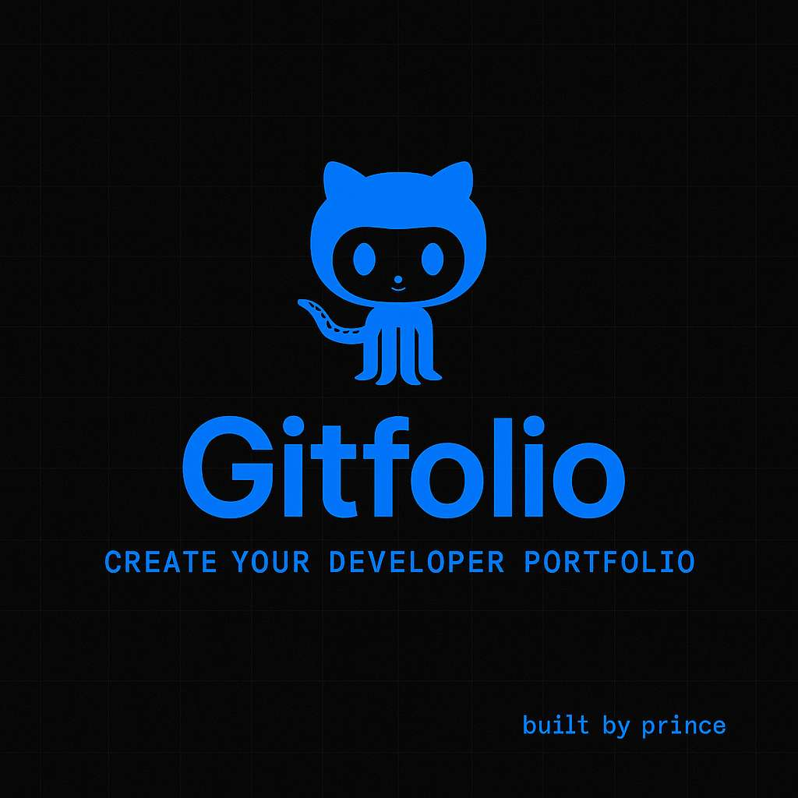

# Gitfolio

A sleek, modern, dark-themed portfolio generator for developers powered by the GitHub API. With just a GitHub username, Gitfolio instantly creates a responsive portfolio showcasing your profile, pinned projects, and repository data.



---

## ✨ Features

- **Instant Setup**  
  Enter your GitHub username and generate a complete portfolio in seconds.

- **Modern UI**  
  Fully responsive dark UI with black and vibrant blue accents, subtle grid backgrounds, and smooth animations.

- **Profile Showcase**  
  Displays your GitHub profile details, bio, stats, and primary coding languages.

- **Pinned Projects**  
  Automatically pulls pinned repositories to feature your best work.

- **All Projects Page**  
  Browse all public repos with search and sort filters such as stars and last updated.

- **About Me Section**  
  Automatically fetches your GitHub profile README for a personalized introduction.

- **Contact Page**  
  Terminal-style contact info view using JetBrains Mono.

- **Dark & Light Mode Toggle**  
  Switch seamlessly between themes.

---

## 🖼 Preview

**Landing Page**  
- Hero section with GitHub username input and "Create My Portfolio" button  
- Feature cards with modern `lucide-react` icons  
- Developer credit footer  

**Portfolio View**  
- Sidebar navigation for desktop or bottom bar for mobile  
- Profile header with avatar, bio, and stats  
- Pinned projects in an elegant grid layout  
- About Me section rendering the README.md from your GitHub profile  


## 📦 Installation

Clone the repository:
build your own big dawg

## 📄 License

MIT License © 2025 Prince

---

**Made with ❤ by Prince**

```
```
